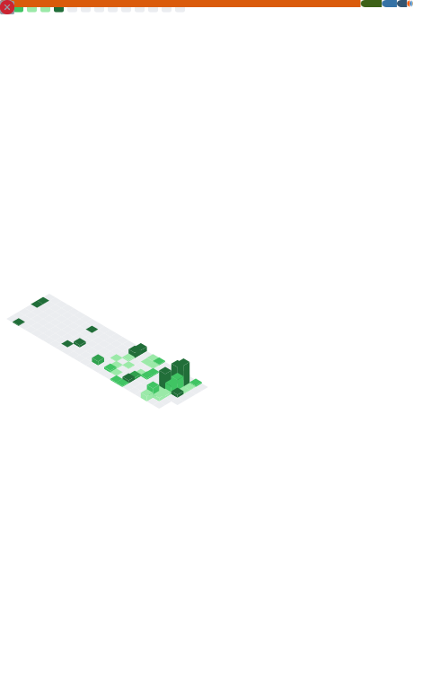

<!-- HEADER BANNER -->

  

  
  
  
  
  

<!-- TYPING TAGLINE -->

  

## 👋 About

I'm a postdoctoral researcher at the [University of Edinburgh](https://www.ed.ac.uk), working in the [VIOS group](https://vios.science) and as part of the [CHAI-UK](https://github.com/CHAI-UK) consortium. My research sits at the intersection of **AI agents**, **causality**, and **medical imaging** — I publish papers and ship tools, both matter to me. On the side I make small 2D games with [Guesswhat-Studio](https://github.com/Guesswhat-Studio) and write at [rasin.cyou](https://rasin.cyou).

## 🔭 Now

- 🤖 Building **agent systems for causal reasoning & education** ([EducAgent](https://github.com/CHAI-UK/EducAgent), [CAUST](https://github.com/vios-s/CAUST)) — recent submissions to top ML venues
- 📰 Maintaining **[Linnet](https://github.com/YuyangXueEd/Linnet)** — a personal AI morning briefing from arXiv / HN / GitHub
- 🧬 Working on **machine unlearning for medical imaging** — see featured work below

## 🛠 Tech Stack

  

## 📚 Featured Research

<table>
  <tr>
    <td></td>
    <td></td>
  </tr>
  <tr>
    <td></td>
    <td></td>
  </tr>
  <tr>
    <td colspan="2" align="center"></td>
  </tr>
</table>

## 🚀 Featured Projects

<table>
  <tr>
    <td></td>
    <td></td>
  </tr>
  <tr>
    <td></td>
    <td></td>
  </tr>
</table>

## 🎮 Off-the-clock

When not in the lab, I make small 2D games with Godot under [Guesswhat-Studio](https://github.com/Guesswhat-Studio), and write occasional notes at [rasin.cyou](https://rasin.cyou).

<table>
  <tr>
    <td></td>
    <td></td>
  </tr>
</table>

## 📊 Stats

  

  

<!-- SNAKE EATING CONTRIBUTIONS -->

  <picture>
    <source media="(prefers-color-scheme: dark)" srcset="https://raw.githubusercontent.com/YuyangXueEd/YuyangXueEd/output/github-contribution-grid-snake-dark.svg" />
    <source media="(prefers-color-scheme: light)" srcset="https://raw.githubusercontent.com/YuyangXueEd/YuyangXueEd/output/github-contribution-grid-snake.svg" />
    
  </picture>

### Rich metrics

## 🏆 Trophies

  

---

📧 <a href="mailto:yuyang.xue@ed.ac.uk">yuyang.xue@ed.ac.uk</a>
 · 🌐 <a href="https://rasin.cyou">rasin.cyou</a>
 · 🎓 <a href="https://scholar.google.com/citations?user=nWQX_0AAAAAJ&hl=en">Scholar</a>
 · 🆔 <a href="https://orcid.org/0000-0002-2281-9418">ORCID</a>

  

